# Лабораторная работа 1
## Основные задания:

### Задание 1 - Привет и возраст 
Программа запрашивает имя и возраст пользователя, затем выводит приветствие и возраст через год.

### Задание 2 - Сумма и среднее
Программа принимает два вещественных числа (с точкой или запятой) и вычисляет их сумму и среднее арифметическое.

### Задание 3 - Чек: скидка и НДС
Программа рассчитывает итоговую стоимость товара с учетом скидки и НДС.

### Задание 4 - Минуты → ЧЧ:ММ
Программа преобразует количество минут в формат часов и минут.

### Задание 5 - Инициалы и длина строки
Программа принимает ФИО, убирает лишние пробелы, выводит инициалы и длину строки.

## Доп. задания:

### Задание 6 - Подсчет участников 
Программа подсчитывает количество участников в очном и заочном формате.

# Лабораторная работа 2

### Задание 1 - arrays.py

Программа состоит из трех функций.
Первая функция возвращает кортеж из минимального и максимального элемента исходного списка, вторая - избавляется от дубликатов и сортирует по возрастанию, третья - «расплющивает» список списков/кортежей в один список по строкам.
#### Код задания:
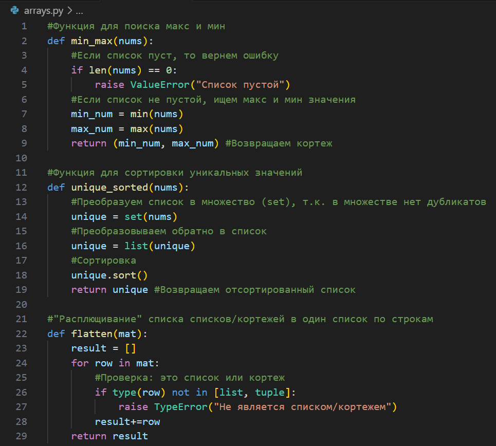
Вызываем тесты:
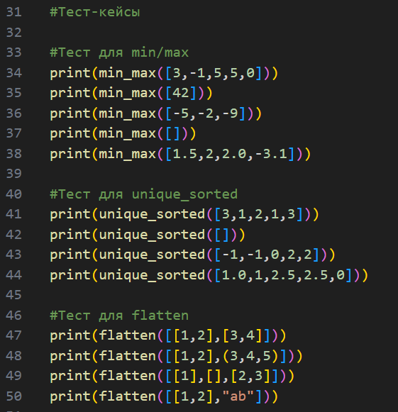
Вывод с ошибкой (по заданию - raise...)
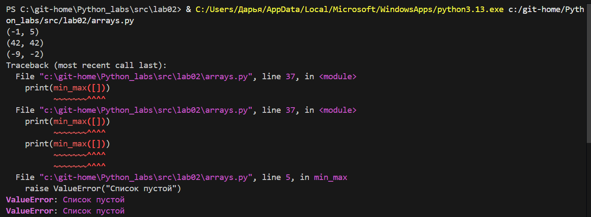
Чтобы избавиться от ошибки в выводе, закомментировала "опасные" строки:
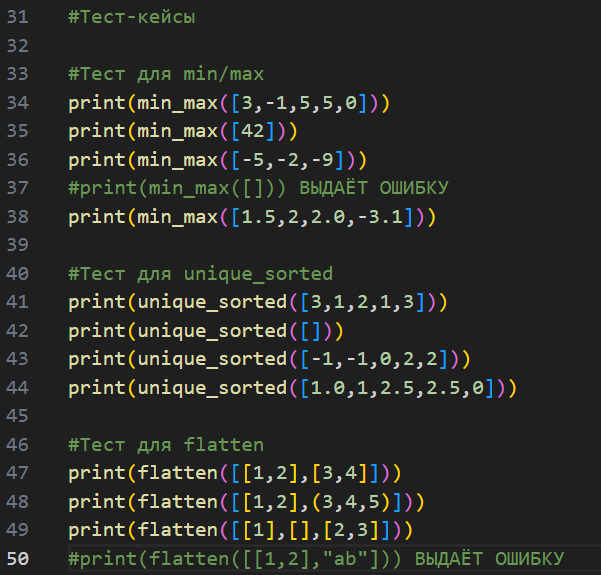
Вывод теперь:

### Задание 2 - matrix.py

Программа состоит из трех функций.
Первая функция транспонирует матрицы, вторая - суммирует по каждой строке, третья - суммирует по каждому столбцу.
#### Код задания:
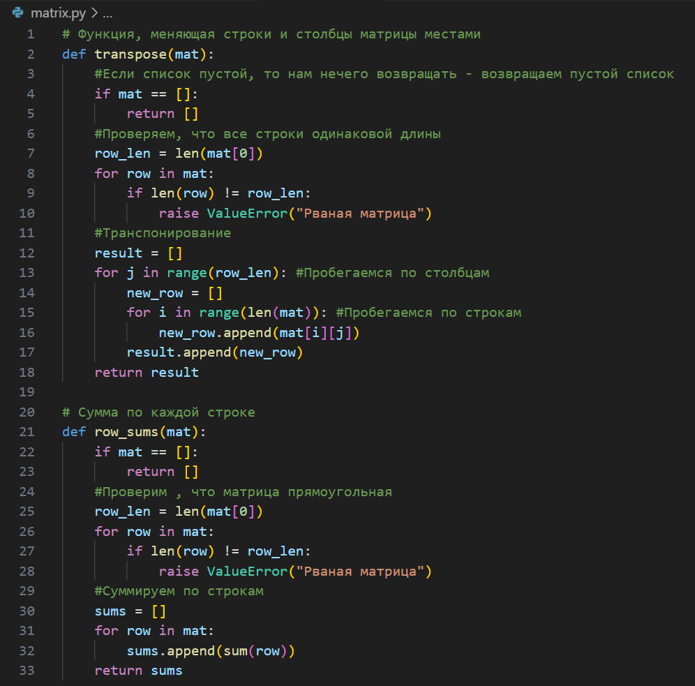
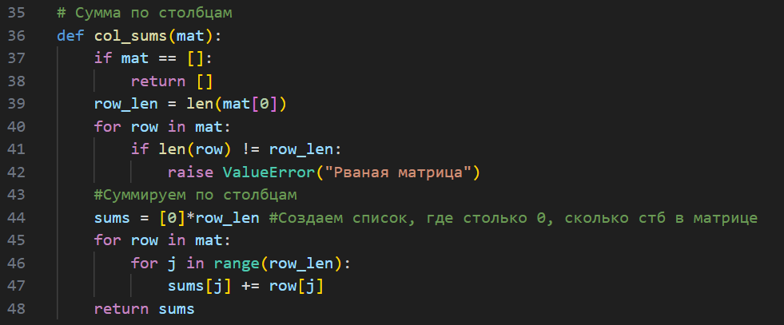
Вызываем тесты:
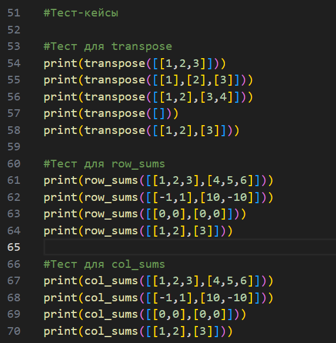
Вывод с ошибкой (по заданию - raise...)
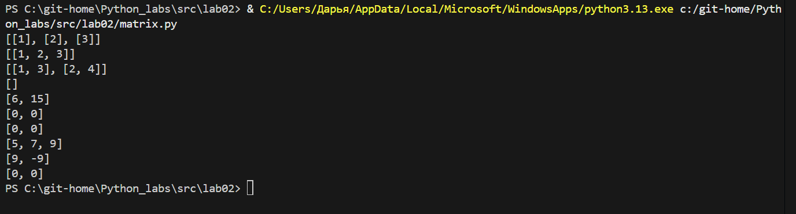
Чтобы избавиться от ошибки в выводе, закомментировала "опасные" строки:
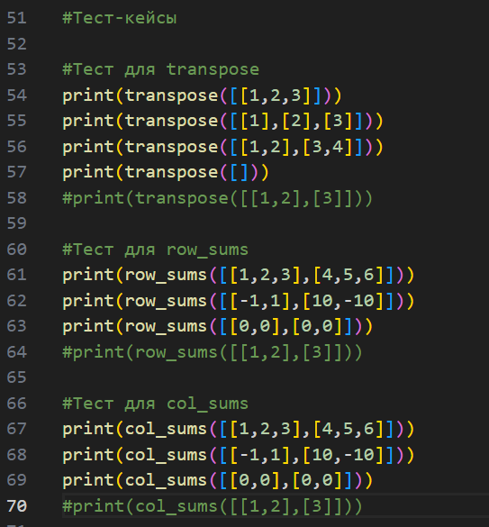
Вывод теперь:

### Задание 3 - tuples.py

Программа принимает на вход кортеж записи студента: фамилия имя отчество (отчества может не быть), его группа и его средний балл. 
#### Код задания:
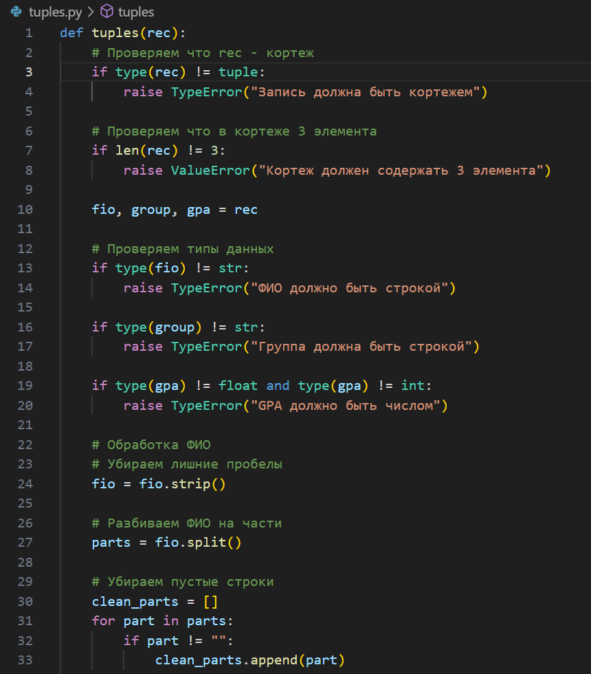
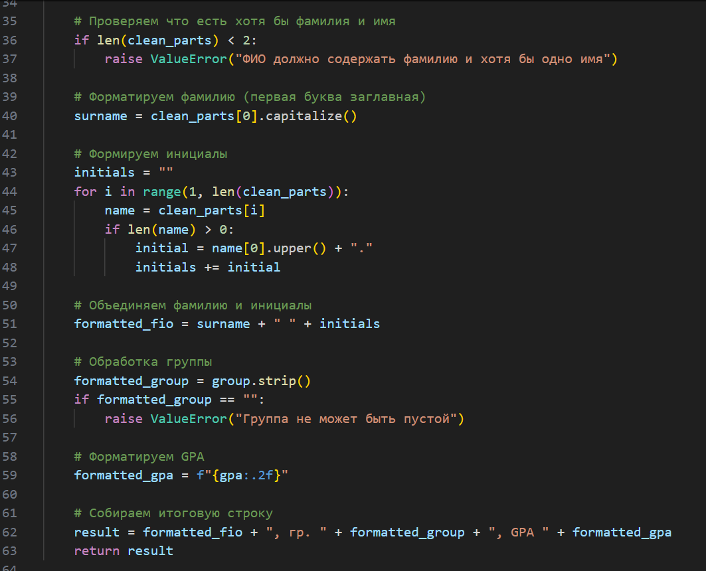
Вызываем тесты:
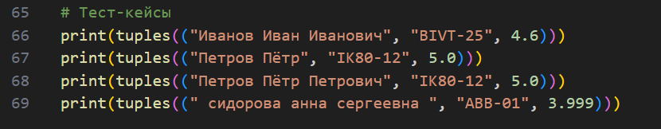
Вывод 
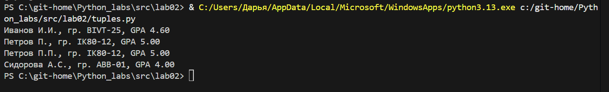