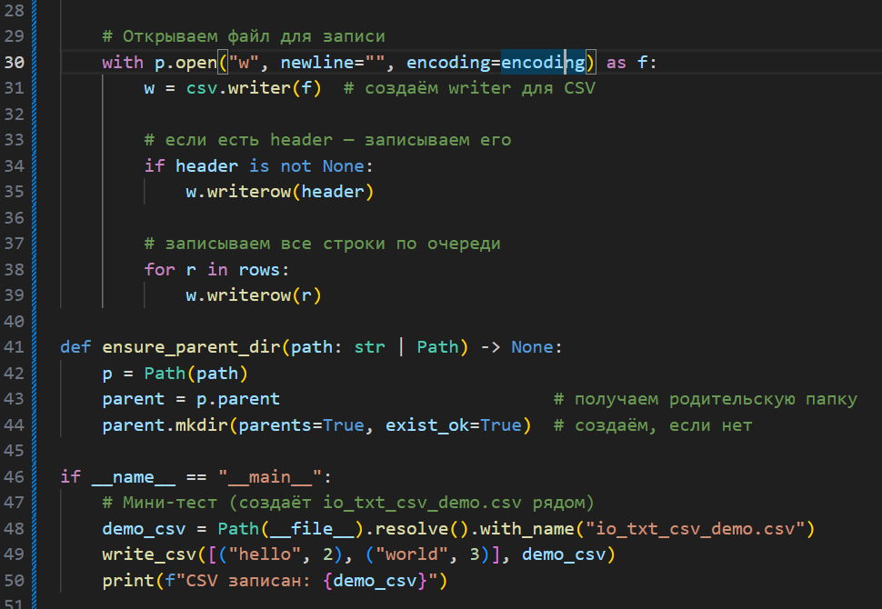
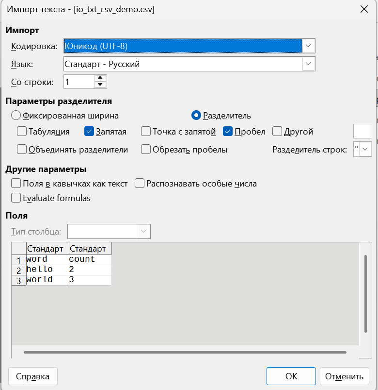
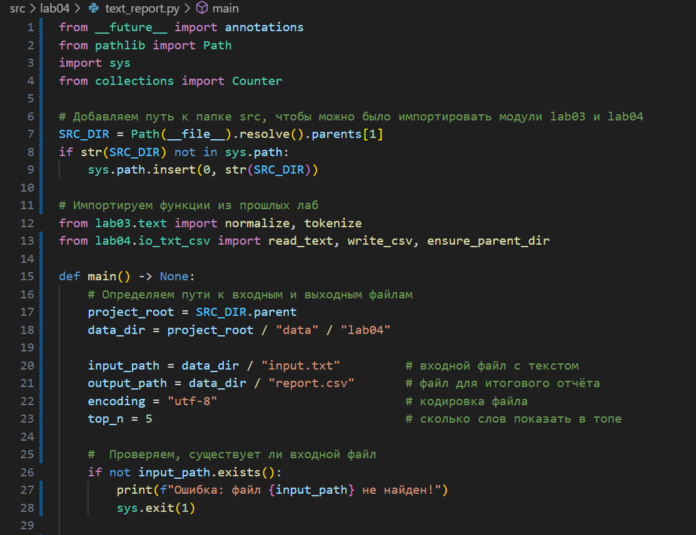
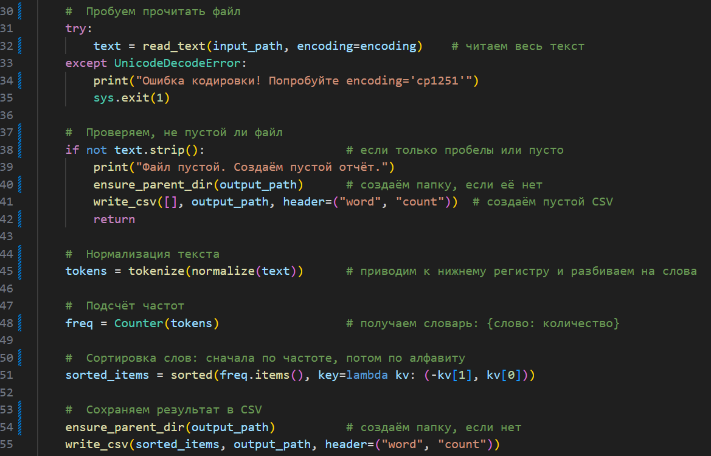
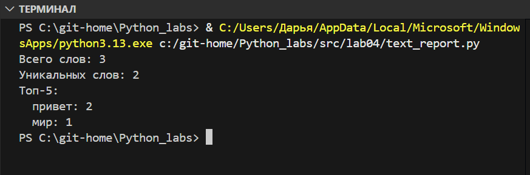

# Лабораторная работа 1
## Основные задания:

### Задание 1 - Привет и возраст 
Программа запрашивает имя и возраст пользователя, затем выводит приветствие и возраст через год.

### Задание 2 - Сумма и среднее
Программа принимает два вещественных числа (с точкой или запятой) и вычисляет их сумму и среднее арифметическое.

### Задание 3 - Чек: скидка и НДС
Программа рассчитывает итоговую стоимость товара с учетом скидки и НДС.

### Задание 4 - Минуты → ЧЧ:ММ
Программа преобразует количество минут в формат часов и минут.

### Задание 5 - Инициалы и длина строки
Программа принимает ФИО, убирает лишние пробелы, выводит инициалы и длину строки.

## Доп. задания:

### Задание 6 - Подсчет участников 
Программа подсчитывает количество участников в очном и заочном формате.

# Лабораторная работа 2

### Задание 1 - arrays.py

Программа состоит из трех функций.
Первая функция возвращает кортеж из минимального и максимального элемента исходного списка, вторая - избавляется от дубликатов и сортирует по возрастанию, третья - «расплющивает» список списков/кортежей в один список по строкам.
#### Код задания:

Вызываем тесты:

Вывод с ошибкой (по заданию - raise...)

Чтобы избавиться от ошибки в выводе, закомментировала "опасные" строки:

Вывод теперь:

### Задание 2 - matrix.py

Программа состоит из трех функций.
Первая функция транспонирует матрицы, вторая - суммирует по каждой строке, третья - суммирует по каждому столбцу.
#### Код задания:

Вызываем тесты:

Вывод с ошибкой (по заданию - raise...)

Чтобы избавиться от ошибки в выводе, закомментировала "опасные" строки:

Вывод теперь:

### Задание 3 - tuples.py

Программа принимает на вход кортеж записи студента: фамилия имя отчество (отчества может не быть), его группа и его средний балл. 
#### Код задания:

Вызываем тесты:

Вывод 

# Лабораторная работа 3

## Задание 1 - text.py

Программа состоит из 4 функций.

Функция normalize() - приводит текст к единому чистому виду.
Она делает все буквы маленькими, меняет Ё на Е, убирает переносы строк, табуляции и лишние пробелы. 

Код функции:

Функция tokenize() - режет текст на отдельные слова.
Она находит все слова (буквы/цифры), видит слова с дефисами, игнорирует знаки препинания и эмодзи. Числа функция тоже считает словами.

Код функции:

Функция count_freq() - считает сколько раз каждое слово встречается в тексте.
Она берет список слов, подсчитывает для каждого слова его количество раз (сколько встречается в тексте) и возвращает словарь вида слово:количество повторений.

Код функции:

Функция top_n() - находит самые популярные слова (топ-5).
Она берет словарь с частотами, сортирует словарь по убыванию частоты (при равных частотах сортирует по алфавиту). Возвращает топ-N слов.

Код функции:

# Лабораторная работа 4

### Задание 1 - io_txt_csv

#### Функция read_text(path, encoding):
Читает весь текст из файла и возвращает его как одну строку.

Она принимает путь к файлу и кодировку (по умолчанию - utf8). Далее открывает файл, читает всё его содержимое и закрывает. Возвращает текст в виде строки. 

#### Функция write_csv(rows, path, header)
Записывает данные в CSV-файл (табличный формат).

Она принимает данные в виде списка строк, путь для сохранения и заголовки. Потом проверяет, что все строки таблицы одинаковой длины. Создает CSV-файл. (Если передан заголовок, то записывает его первой строкой)

#### Функция ensure_parent_dir(path)
Создает все папки для пути к файлу, если они не существуют.

Она принимает путь к файлу, проверяет существование родительских папок и создаёт недостающие папки.

Код задания:

Для теста создала доп. файл -- test_io_txt_csv

Запустила программу. У меня создался csv-файл:

### Задание 2 -- text_report

Эта программа анализирует текстовый файл, подсчитывает частоту встречаемости слов и создает отчет в формате CSV.

Программа проверяет, существует ли файл с текстом. Если его нет, то выводит ошибку и завершает работу. 
Если файл есть, то пытается его прочитать в указанной кодировке, если возникает ошибка, то предлагает попробовать другую кодировку.
Проверяет, не пустой ли файл (иначе - создаёт пустой отчёт и завершает работу).

Обрабатывает текст. Для этого мы используем функции из прошлой лабораторной работы. 
Функция normalize(text) - приводит текст к нижнему регистру.
Функция tokenize(text) - разбивает текст на отдельные слова.
Также программа подсчитывает, сколько раз каждое слово встречается в тексте и сортирует слова: сначала по частоте (в порядке убывания), а потом по алфавиту. 

Результаты сохраняются в csv-файл с колонками word и count.
В терминале выводится статистика: общее кол-во слов в тексте, кол-во уникальных слов и список топ-N самых часто встречающихся слов. 

Код задания:

Запускаем файл:

# Лабораторная работа 5

### Задание 1 - json_csv

Модуль содержит две функции для конвертации данных между JSON и CSV:

   - json_to_csv(json_path, csv_path) — преобразует данные из JSON-файла в CSV.
   - csv_to_json(csv_path, json_path) — преобразует данные из CSV-файла в JSON.

#### Функция json_to_csv

Функция принимает путь к JSON-файлу и путь к создаваемому CSV-файлу.

1. Проверка расширений файлов.  
   Вход обязан быть .json, выход — .csv.  
   Если расширения файлов не совпадают, создаётся ошибка ValueError.

2. Проверка существования входного файла.  
   Если JSON-файл не найден, то пользователю отправляется ошибка FileNotFoundError.

3. Проверка, что файл не пустой. 
   Считывается содержимое, и если после удаления пробелов текст пустой, то пользователю отправляется ошибка ValueError.

4. Попытка загрузить JSON.
   Если JSON повреждён или неверного формата, то пользователю отправляется ошибка ValueError.

5. Проверка структуры данных. 
   Ожидается список словарей, но если это не та, то пользователю отправляется ошибка.

6. Формирование заголовков CSV.  
   Собираются все ключи из всех словарей. Заголовок сортируется по алфавиту для фиксированного порядка колонок.

7. Запись CSV-файла.
   Создаётся `DictWriter`. Записывается строка заголовков. Каждая запись из JSON превращается в строку CSV.  
   Если в каком-то объекте нет какого-то ключа, то будет пустая строка.

#### Функция csv_to_json

Функция принимает путь к CSV-файлу и путь к создаваемому JSON-файлу.

1. Проверка расширений.
   Вход — обязательно .csv, выход — .json. (как в прошлой функции, но наоборот)

2. Проверка существования файла.
   Если CSV-файл отсутствует, то пользователю отправляется ошибка FileNotFoundError. (как в прошлой функции)

3. Проверка, что CSV не пустой.  
   Если файл пуст, то пользователю отправляется ошибка ValueError. (как в прошлой функции)

4. Определение разделителя.
   С помощью csv.Sniffer функция пытается автоматически определить разделитель (запятая, точка с запятой и т.д.).  
   Если определить разделитель не удаётся, то по умолчанию разделителем считается пробел.

5. Чтение CSV.
   Используется `DictReader`, где первая строка — заголовок. Если заголовка нет, то пользователю отправляется ошибка. Все строки превращаются в словари.

7. Запись JSON. 
   Полученный список словарей сохраняется в JSON-файл.

Код задания:

### Задание 2 - json_csv

Модуль преобразовывает данные из формата CSV в файл Excel формата .xlsx.  
Основная задача функции csv_to_xlsx — прочитать CSV-файл, перенести все строки в Excel-таблицу и сохранить результат.

#### Функция csv_to_xlsx

Функция принимает путь к исходному CSV-файлу и путь к создаваемому XLSX-файлу.

1. Проверка расширений. 
   Вход — обязательно .csv, выход — .xlsx.
   Если расширения не совпадают с ожидаемыми, то пользователю отправляется ошибка.
   
2. Проверка существования файла. 
   Создается Path для csv_path. Если файл по этому пути не найден, то пользователю отправляется ошибка.

3. Чтение CSV.
   Файл открывается в режиме чтения. Используется csv.reader, каждая строка CSV превращается в список значений (ячейки).
   Все строки сразу собираются в список rows. Если список пустой, то пользователю отправляется ошибка.

4. Создание Excel-книги и листа.
   Создается объект Workbook. Создается лист и ему присваивается название "Sheet1".

5. Перенос данных из CSV в Excel.
   Для каждой строки из rows вызывается ws.append(row).
   В результате каждая строка CSV становится строкой в Excel-таблице, ячейки сохраняют свои значения в том же порядке.

6. Настройка ширины колонок.
   Вычисляется максимальное количество колонок: берётся максимальная длина строки. Далее для каждой колонки: перебираются все строки, чтобы найти максимальную длину текста в         ячейках этой колонки и после прохода по строкам устанавливается ширина колонки = 8.

7. Сохранение XLSX-файла.
   В конце книга сохраняется по указанному пути.

Код задания:

### Код для теста 

### Результаты теста 

Для задания 1:

Для задания 2:

# Лабораторная работа 6

### Задание 1 - cli_text

На этом скрине видно начало файла с текстовыми утилитами.
Объявлена функция main():
- Внутри main() создаётся объект ArgumentParser с описанием, что это утилиты cat и stats.
- Затем создаётся «подраздел» для подкоманд: subparsers = parser.add_subparsers(dest="command"). Это значит, что у программы будет несколько подкоманд, и выбранная подкоманда будет лежать в args.command.
Дальше описывается подкоманда cat:
- Через subparsers.add_parser("cat", ...) создаётся подкоманда с именем cat и коротким описанием.
- У неё есть аргумент --input — путь к файлу, он обязательный (required=True).
- И есть флаг -n — если пользователь его укажет, строки нужно будет нумеровать.
Затем описывается подкоманда stats:
- Точно так же создаётся подкоманда stats с описанием «Частоты слов».
- У неё тоже есть обязательный аргумент --input — текстовый файл.
- И аргумент --top, который задаёт, сколько самых частых слов выводить. Для него задан тип int и значение по умолчанию 5.

Здесь показана логика обработки аргументов и реализация подкоманды cat.
- Сначала делается args = parser.parse_args() — программа читает, что именно пользователь написал в командной строке.
- Если args.command не задан, значит пользователь не указал, какую подкоманду он хочет (cat или stats). В этом случае вызывается parser.error с сообщением, что нужно указать подкоманду.
Дальше идёт ветка if args.command == "cat": — то есть разбор подкоманды cat.
- Из аргумента --input берётся путь и оборачивается в объект Path.
- Если такого файла нет (not path.exists()), выбрасывается ошибка FileNotFoundError. По заданию именно такое исключение должно возникать при отсутствии файла.
- Если файл есть, он читается целиком как текст в кодировке UTF-8.
Затем идёт цикл по строкам файла:
- text.splitlines() разбивает текст на отдельные строки.
- enumerate(..., start=1) даёт сразу номер строки и её содержимое.
- Если флаг -n был указан (args.n истинен), выводится номер строки и сам текст через табуляцию.
- Если флага нет, выводится только текст строки без номера.
Таким образом реализуется поведение маленькой версии команды cat с возможностью нумерации строк.

Здесь показана реализация подкоманды stats и запуск программы.
В ветке elif args.command == "stats": выполняются следующие шаги:
- Сначала проверяется, что параметр --top больше нуля. Если он нулевой или отрицательный, программа выводит ошибку, что top должно быть положительным числом.
- Проверяется наличие входного файла --input так же, как и в cat. При отсутствии — FileNotFoundError.
- Файл читается как текст в UTF-8. Если после обрезки пробелов текст пустой, программа выдаёт сообщение, что файл пустой.
Далее идёт разбор слов и подсчёт частот:
- Текст переводится в нижний регистр.
- С помощью регулярного выражения \w+ находятся все «слова» — последовательности букв и цифр.
- На основе списка слов создаётся Counter, который считает, сколько раз каждое слово встретилось.
- Затем берётся args.top самых частых слов и для каждого выводится строка вида: слово — табуляция — количество.
В самом конце файла стоит стандартная конструкция:
- if __name__ == "__main__": main() — это значит, что при запуске файла напрямую из Python будет вызвана функция main().

### Задание 1 - cli_convert

Это начало второй программы — конвертера форматов.
Внутри main():
- Создаётся объект ArgumentParser с описанием, что это конвертеры JSON/CSV/XLSX.
- Добавляются подкоманды через sub = parser.add_subparsers(dest="cmd"). Имя выбранной подкоманды будет храниться в args.cmd.
Дальше описываются три подкоманды: json2csv, csv2json, csv2xlsx.
В конце этого скрина показан вызов parser.parse_args(), который читает аргументы командной строки, и проверка, что подкоманда вообще была указана.

Здесь показано, как на основе выбранной подкоманды вызываются функции из ЛР5, и как обрабатываются ошибки.

На этом скрине видно запуск команды. В результате в консоли выводится содержимое CSV-файла, и перед каждой строкой отображается её номер: сначала строка заголовков, затем строки с данными (имя, возраст, город). Это демонстрирует корректную работу подкоманды cat и флага -n.

Здесь в результате на экране появляется столбик слов и рядом с каждым — число, сколько раз оно встретилось. В примере видно, что чаще всего встречаются имена alice, bob, слово python и некоторые короткие служебные слова. Это подтверждает, что разбор слов и подсчёт частот работают правильно.

После выполнения команда завершается без ошибок, а в каталоге data/out появляется новый CSV-файл, который затем используется в следующих тестах.

Остальные полученные файлы после работой с командной строкой:

