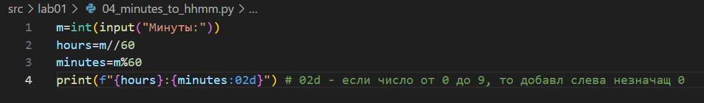
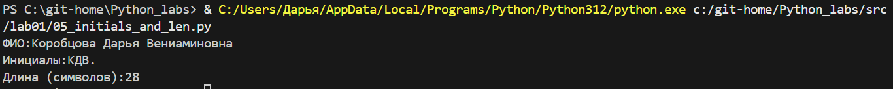
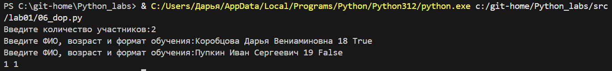

# Лабораторная работа 1
## Основные задания:

### Задание 1 - Привет и возраст 
Программа запрашивает имя и возраст пользователя, затем выводит приветствие и возраст через год.

### Задание 2 - Сумма и среднее
Программа принимает два вещественных числа (с точкой или запятой) и вычисляет их сумму и среднее арифметическое.

### Задание 3 - Чек: скидка и НДС
Программа рассчитывает итоговую стоимость товара с учетом скидки и НДС.

### Задание 4 - Минуты → ЧЧ:ММ
Программа преобразует количество минут в формат часов и минут.

### Задание 5 - Инициалы и длина строки
Программа принимает ФИО, убирает лишние пробелы, выводит инициалы и длину строки.

## Доп. задания:

### Задание 6 - Подсчет участников 
Программа подсчитывает количество участников в очном и заочном формате.

